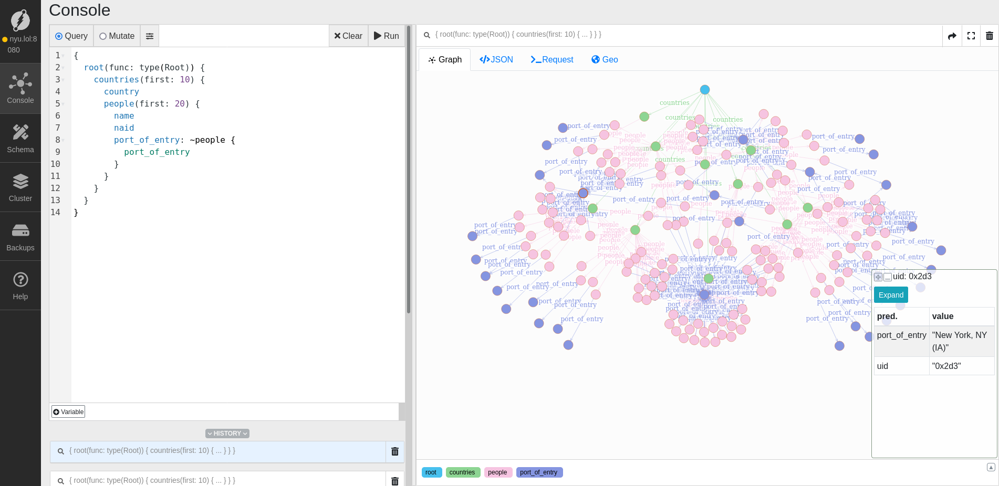
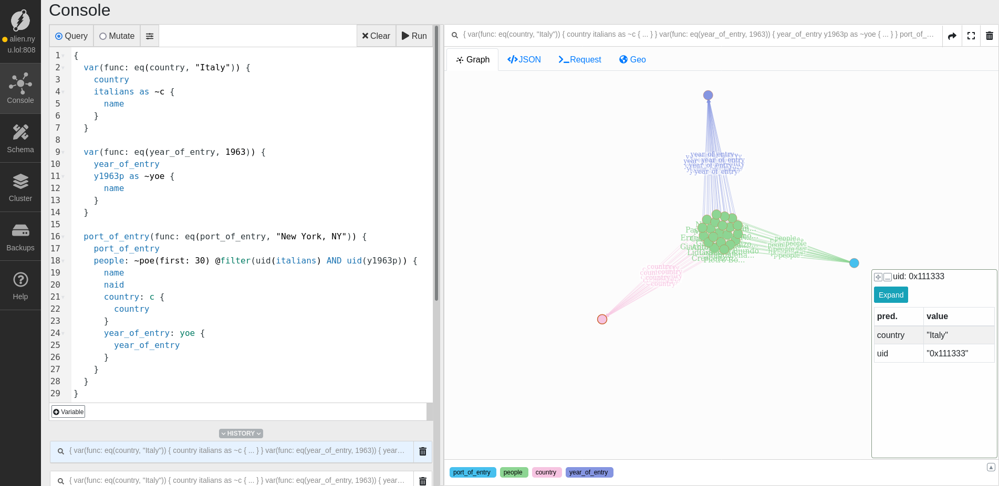
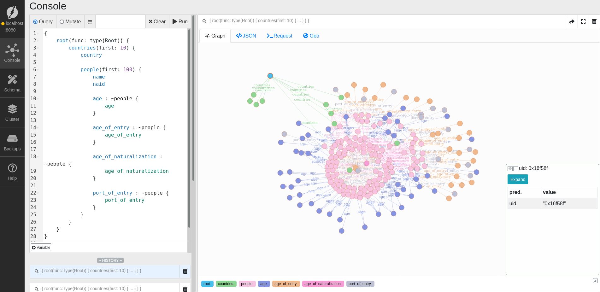
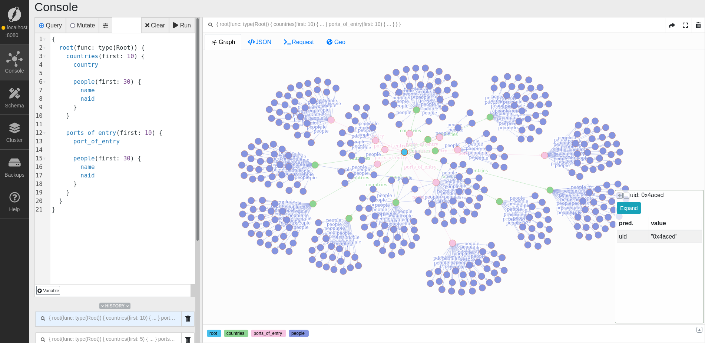

# Hist 175 Final Project


```graphql
{
	port_of_entry(func: eq(port_of_entry, "New York, NY")) {
		port_of_entry
		people: ~poe {
			name
			naid
			country: c {
				country
			}
			year_of_entry: yoe {
				year_of_entry
			}
		}
	}
}
```



---


```graphql
{
  var(func: eq(country, "Italy")) {
		country
    italians as ~c {
			name
    }
  }
  
  var(func: eq(year_of_entry, 1963)) {
		year_of_entry
    y1963p as ~yoe {
			name
    }
  }
  
	port_of_entry(func: eq(port_of_entry, "New York, NY")) {
		port_of_entry
		people: ~poe(first: 30) @filter(uid(italians) AND uid(y1963p)) {
			name
			naid
			country: c {
				country
			}
			year_of_entry: yoe {
				year_of_entry
			}
		}
	}
}
```




---

```graphql
{
    root(func: type(Root)) {
        countries(first: 10) {
            country

            people(first: 30) {
                name
                naid

                age : ~people {
                    age
                }

                age_of_entry : ~people {
                    age_of_entry
                }

                age_of_naturalization : ~people {
                    age_of_naturalization
                }

                port_of_entry : ~people {
                    port_of_entry
                }
            }
        }
    }
}
```




---

```graphql
{
    root(func: type(Root)) {
        countries(first: 10) {
            country

            people(first: 30) {
                name
                naid
            }
        }

        ports_of_entry(first: 10) {
            port_of_entry

            people(first: 30) {
                name
                naid
            }
        }
    }
}
```


